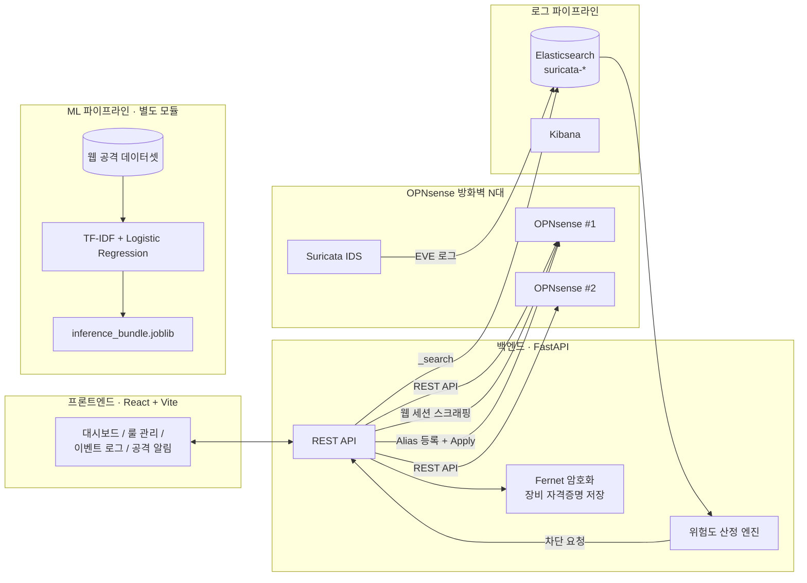

# OPNsense Multi-Firewall Security Dashboard

> 여러 대의 OPNsense 방화벽을 하나의 웹 대시보드에서 관리하고, Suricata IDS 이벤트를 위험도 기반으로 분석해 공격 IP를 즉시 차단하는 보안 운영 자동화 시스템입니다.
> 웹 페이로드 기반 공격 유형 분류 ML 파이프라인을 함께 포함합니다.

---

## 목차

1. [프로젝트 개요](#프로젝트-개요)
2. [시스템 아키텍처](#시스템-아키텍처)
3. [주요 기능](#주요-기능)
4. [공격 유형 분류 ML](#공격-유형-분류-ml)
5. [기술 스택](#기술-스택)
6. [프로젝트 구조](#프로젝트-구조)
7. [API 명세](#api-명세)
8. [실행 방법](#실행-방법)
9. [한계 및 개선 방향](#한계-및-개선-방향)

---

## 프로젝트 개요

방화벽이 여러 대일수록 장비마다 웹 UI에 접속해 룰을 확인하고, IDS 로그를 따로 검색하고, 공격 IP를 수동으로 차단해야 하는 운영 부담이 커집니다.
본 프로젝트는 이 과정을 다음 세 가지로 통합합니다.

- **통합 관리**: 여러 OPNsense 장비를 등록해 상태 모니터링, 룰 · 별칭(Alias) 관리를 한 화면에서 수행
- **탐지 → 대응 자동화**: Elasticsearch에 수집된 Suricata 이벤트를 위험도 점수로 정렬하고, 버튼 하나로 공격 IP를 차단 Alias에 등록 · 즉시 적용
- **지능형 분류**: HTTP 페이로드를 7개 클래스(정상 + 6개 공격 유형)로 분류하는 ML 모델 학습 및 편향 검증

---

## 시스템 아키텍처



---

## 주요 기능

### 1. 방화벽 장비 관리
여러 OPNsense 장비를 이름, 호스트, API Key/Secret, 로그 인덱스와 함께 등록 · 수정 · 삭제합니다.
API 자격증명은 Fernet(AES-128-CBC + HMAC-SHA256)으로 암호화해 저장하며, 조회 응답에는 포함되지 않습니다.

### 2. 대시보드
선택한 장비의 시스템 정보, CPU · 메모리 · 디스크 사용률, 인터페이스 트래픽, 서비스 상태를 차트로 보여 주며 자동 새로고침을 지원합니다.

### 3. 룰 · 별칭 관리
- **자동화 룰**: OPNsense `filter` API로 룰 조회 · 추가 · 수정 · 삭제 후 Apply
- **인터페이스별 룰**: 인터페이스 단위로 룰을 필터링해 관리
- **레거시 룰 조회**: API로 제공되지 않는 기존 인터페이스 룰은 웹 세션 로그인(CSRF 처리) 후 HTML 테이블을 파싱해 조회
- **Alias**: 별칭 목록 조회, 주소 추가 · 삭제

### 4. 방화벽 이벤트 로그 (Elasticsearch)
Suricata 이벤트를 기간, IP, 포트, 시그니처 등으로 검색하고, 인덱스별 조회 · Kibana 형식 CSV 내보내기를 지원합니다.

### 5. OPNsense 로그 파일
방화벽 자체 필터 로그를 정규화해 보여 주며, 필드별 포함 · 일치 · 제외 조건 검색과 개요 통계를 제공합니다.

### 6. 실시간 공격 알림 및 원클릭 차단
Suricata 이벤트에서 공격성 이벤트만 추려 출발지 IP 단위로 묶고, 0~100점 위험도를 산정합니다.

| 요소 | 가중치 예시 |
| --- | --- |
| 이벤트 유형 | alert +25, drop/block +20 |
| Suricata 심각도 | 1단계 +30, 2단계 +22, 3단계 +12 |
| 시그니처 · 카테고리 키워드 | exploit · malware +22, ransom · ddos +25, sql · xss +14 등 (최대 +35) |
| 동일 출발지 반복 | 10회 이상 +25, 5회 이상 +18, 3회 이상 +10 |
| 목적지 포트 | 관리 · DB 포트(22, 3389, 445, 3306 등) +12, 웹 포트 +7 |
| 공인 IP 출발지 | +8 |

점수에 따라 `critical`(90↑) · `high`(70↑) · `medium`(40↑) · `low`로 분류하며, 차단 버튼을 누르면 해당 IP를 `blocked_attackers` Alias에 추가하고 방화벽 설정을 즉시 적용합니다.
사설 · 예약 IP는 오차단을 막기 위해 기본적으로 차단하지 않으며, 실습 환경에서는 `force` 옵션으로 허용할 수 있습니다.

---

## 공격 유형 분류 ML

`ml/` 디렉터리는 HTTP 요청 페이로드를 공격 유형별로 분류하는 독립 파이프라인입니다.

### 분류 클래스

`Normal`, `Cross_Site_Scripting`, `SQL_Injection`, `System_Cmd_Execution`, `Path_Disclosure`, `HOST_Scan`, `Vulnerability_Scan`

데이터셋마다 다른 라벨 표기(`XSS`, `SQLi`, `Command_Injection` 등)는 `configs/labels.json`의 별칭 규칙으로 통일합니다.

### 파이프라인


- **피처**: 문자 단위(char_wb 3–6gram, 최대 5만 개)와 단어 단위(1–2gram, 최대 2.5만 개) TF-IDF 결합
- **하이퍼파라미터**: 검증셋으로만 선택(C=6에서 성능 정점, 그 이상은 과적합), 최종 모델은 train + valid로 재학습
- **테스트셋 구성**: 클래스 균형 비율(Normal 40%)과 실제 트래픽에 가까운 비율(Normal 80%) 두 가지로 평가
- **외부 데이터 보강**: HttpParamsDataset 일부를 학습 전용으로 추가

### 편향 검증

모델이 공격 패턴이 아닌 데이터셋 특유의 흔적(스캐너 도구명 등)을 학습했는지 확인하기 위한 분석을 포함합니다.

| 스크립트 | 내용 |
| --- | --- |
| `run_toolname_mask_eval.py` | 스캐너 · 도구명을 마스킹한 뒤 성능 변화 측정 |
| `run_analysis.py` | 클래스별 상위 n-gram 점검, 피처 분포, Logistic Regression 계수 분석 |
| `run_ablation.py` | 피처 그룹별(TF-IDF, n-gram 점수, 파생 피처) 성능 비교 |

### 2-모듈 구조 실험 (`model_train_v2.py`)

스캔 계열은 페이로드보다 트래픽 패턴이 특징적이라는 점에 착안한 실험입니다.

- **모듈 A**: 플로우 통계(패킷 수, 바이트, IAT, TCP 플래그 비율 등)로 `Normal` / `HOST_Scan` / `Vulnerability_Scan` 분류 (HistGradientBoosting)
- **모듈 B**: 페이로드 TF-IDF로 XSS · SQLi · Path Disclosure · Command Execution 분류 (Logistic Regression)
- **평가 뷰**: 7클래스 세밀 뷰와, 혼동이 잦은 Path Disclosure · Command Execution을 `File_Access_Attack`으로 합친 6클래스 견고 뷰를 함께 보고

### 실행

```bash
cd ml
pip install -r requirements.txt

python run_prepare_dataset.py        # 데이터 정제 · 분할
python run_train.py                  # 학습
python run_eval.py                   # 평가
python run_retrain.py                # train + valid 재학습 → 추론 번들 생성
python run_infer.py --payload "<payload>"   # 단일 페이로드 추론
```

> 원본 데이터셋과 학습 산출물(모델, 벡터라이저, 리포트)은 용량 및 라이선스 문제로 저장소에 포함하지 않습니다.

### 결과

<!-- TODO: outputs/reports 결과로 채워 주세요 -->

| 테스트셋 | Accuracy | Macro-F1 |
| --- | --- | --- |
| 균형 비율 | | |
| 현실 비율 | | |

---

## 기술 스택

| 구분 | 사용 기술 |
| --- | --- |
| 방화벽 · IDS | OPNsense, Suricata |
| 로그 파이프라인 | Elasticsearch, Kibana |
| 백엔드 | Python, FastAPI, Uvicorn, requests, BeautifulSoup, cryptography(Fernet) |
| 프론트엔드 | React 19, Vite, Recharts |
| ML | scikit-learn, pandas, NumPy, SciPy, joblib |

---

## 프로젝트 구조

```
opnsense/
├─ backend/
│  ├─ main.py                    # FastAPI 서버 (장비 관리, 룰, 로그, 공격 알림)
│  ├─ requirements.txt
│  └─ data/                      # 암호화된 장비 정보 저장 위치 (Git 제외)
│
├─ frontend/
│  ├─ src/
│  │  ├─ App.jsx                 # 페이지 전환 · 장비 선택 · API 호출
│  │  ├─ pages/                  # 대시보드, 룰, 이벤트 로그, 공격 알림, 장비 관리 등
│  │  ├─ components/dashboard/   # 차트 · 게이지 · 상태 카드
│  │  ├─ components/rules/       # 룰 폼 · 테이블
│  │  └─ utils/logCsvExport.js   # 로그 CSV 내보내기
│  └─ server.js                  # 초기 버전 Express 프록시 (현재 미사용)
│
├─ ml/
│  ├─ configs/                   # 라벨 별칭, 분할 비율, TF-IDF 설정
│  ├─ src/
│  │  ├─ data/                   # 로더, 정제, 분할
│  │  ├─ preprocess/             # 정규화, 토크나이저, 라벨 매핑
│  │  ├─ features/               # TF-IDF, n-gram 선택, 파생 피처
│  │  ├─ models/                 # 번들 저장 · 로드, 추론
│  │  ├─ analysis/               # 편향 검증 · ablation · 계수 분석
│  │  └─ evaluation/             # 리포트, 오분류 저장
│  ├─ run_*.py                   # 단계별 실행 스크립트
│  └─ model_train_v2.py          # 2-모듈 구조 실험
│
└─ keygen.py                     # Fernet 암호화 키 생성
```

---

## API 명세

| Method | Endpoint | 설명 |
| --- | --- | --- |
| `GET` · `POST` | `/api/firewalls` | 장비 목록 조회 · 등록 |
| `PUT` · `DELETE` | `/api/firewalls/{id}` | 장비 수정 · 삭제 |
| `GET` | `/api/firewalls/{id}/dashboard` | 시스템 · 리소스 · 트래픽 요약 |
| `GET` · `POST` | `/api/firewalls/{id}/rules` | 자동화 룰 조회 · 추가 |
| `DELETE` | `/api/firewalls/{id}/rules/{uuid}` | 룰 삭제 |
| `GET` | `/api/firewalls/{id}/interfaces` | 인터페이스 목록 |
| `GET` · `POST` | `/api/firewalls/{id}/interface-rules` | 인터페이스별 룰 조회 · 추가 |
| `PUT` · `DELETE` | `/api/firewalls/{id}/interface-rules/{uuid}` | 인터페이스별 룰 수정 · 삭제 |
| `POST` | `/api/firewalls/{id}/interface-rules/apply` | 룰 변경 적용 |
| `GET` | `/api/firewalls/{id}/legacy-interface-rules` | 레거시 인터페이스 룰 조회 (웹 스크래핑) |
| `GET` | `/api/firewalls/{id}/aliases` | Alias 목록 |
| `GET` | `/api/firewalls/{id}/alias/{name}` | Alias 항목 조회 |
| `POST` | `/api/firewalls/{id}/alias/{name}/add` · `/delete` | Alias 주소 추가 · 삭제 |
| `POST` | `/api/firewalls/{id}/event-logs` | Elasticsearch Suricata 이벤트 검색 |
| `POST` | `/api/firewalls/{id}/opnsense-logs` | OPNsense 필터 로그 검색 |
| `GET` | `/api/firewalls/{id}/security-alerts` | 위험도 기반 공격 알림 목록 |
| `POST` | `/api/firewalls/{id}/security-alerts/{alert_id}/block` | 공격 IP 차단 |
| `GET` | `/api/firewalls/{id}/security-blocked-ips` | 차단된 IP 목록 |

---

## 실행 방법

### 사전 요구사항

- OPNsense 방화벽 (API Key/Secret 발급, 차단용 Alias `blocked_attackers` 생성 및 해당 Alias를 출발지로 하는 차단 룰 등록)
- Suricata EVE 로그를 수집하는 Elasticsearch
- Python 3.11+, Node.js 20+

### 1. 백엔드

```bash
cd backend
pip install -r requirements.txt beautifulsoup4 cryptography
python ../keygen.py            # 출력된 키를 APP_ENCRYPTION_KEY에 입력
```

`backend/.env` 파일을 만들고 아래 값을 채웁니다.

```env
# OPNsense
OPNSENSE_HOST=https://<방화벽 주소>
OPNSENSE_API_KEY=<API Key>
OPNSENSE_API_SECRET=<API Secret>
OPNSENSE_VERIFY_SSL=false
OPNSENSE_TIMEOUT=20
OPNSENSE_WEB_USERNAME=<웹 UI 계정>      # 레거시 룰 조회용
OPNSENSE_WEB_PASSWORD=<웹 UI 비밀번호>

# 장비 자격증명 암호화 키 (keygen.py 출력값)
APP_ENCRYPTION_KEY=<Fernet Key>

# Elasticsearch (API Key 또는 계정 중 하나)
ELASTIC_URL=https://<ES 주소>:9200
ELASTIC_API_KEY=<API Key>
ELASTIC_USERNAME=<계정>
ELASTIC_PASSWORD=<비밀번호>
ELASTIC_VERIFY_SSL=false
ELASTIC_INDEX=suricata-*

# 차단용 Alias 이름 (선택)
SECURITY_BLOCK_ALIAS=blocked_attackers
```

```bash
uvicorn main:app --host 127.0.0.1 --port 8000 --reload
```

### 2. 프론트엔드

```bash
cd frontend
npm install
npm run dev
```

http://localhost:5173 에서 접속한 뒤 **방화벽 관리** 메뉴에서 장비를 등록합니다.

---

## 한계 및 개선 방향

- **접근 제어 부재**: 백엔드 API와 대시보드에 사용자 인증이 없어 방화벽 룰 변경 · IP 차단 권한이 네트워크 접근만으로 열려 있습니다. 로그인과 역할 기반 권한 분리가 필요합니다.
- **TLS 검증 비활성화**: 실습 환경 편의를 위해 OPNsense · Elasticsearch 인증서 검증을 끄고 있습니다. 운영 환경에서는 사설 CA 인증서를 등록해 검증을 활성화해야 합니다.
- **규칙 기반 위험도 산정**: 현재 위험도는 고정 가중치 규칙입니다. ML 분류 결과를 위험도 산정과 차단 판단에 통합하는 것이 다음 단계입니다.
- **ML 모델 미연동**: 학습된 분류 모델은 아직 백엔드와 연결되지 않은 독립 모듈입니다.
- **레거시 룰 조회 방식**: 웹 UI HTML을 파싱하므로 OPNsense 버전이 바뀌면 동작하지 않을 수 있습니다.
- **차단 자동화 범위**: 차단은 사람이 버튼으로 승인하는 반자동 방식이며, 차단 해제 만료(TTL) 기능은 없습니다.

---

## 팀

**Fastgraduate**

<!-- TODO: 팀원과 담당 파트를 채워 주세요 -->

| 이름 | GitHub | 담당 |
| --- | --- | --- |
| | [rudrb](https://github.com/rudrb) | |
| | [persipica](https://github.com/persipica) | |
| | | |
